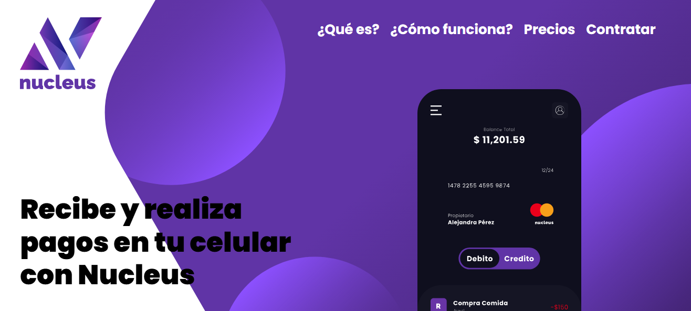
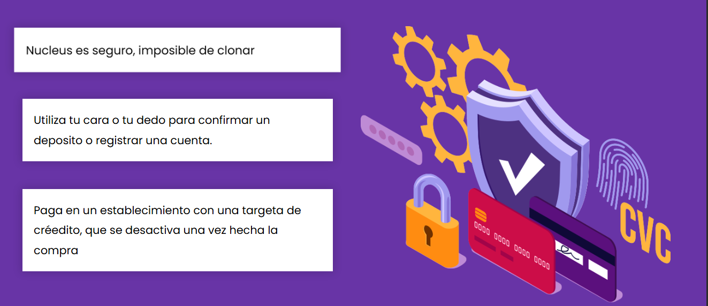
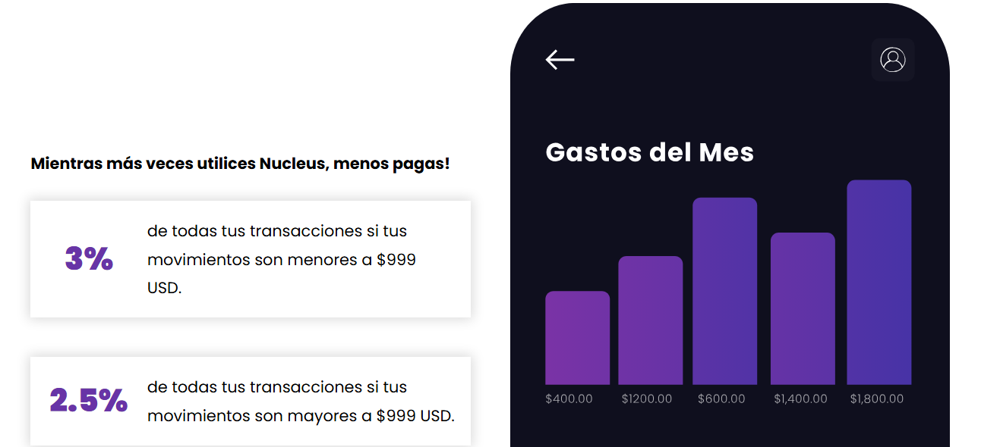
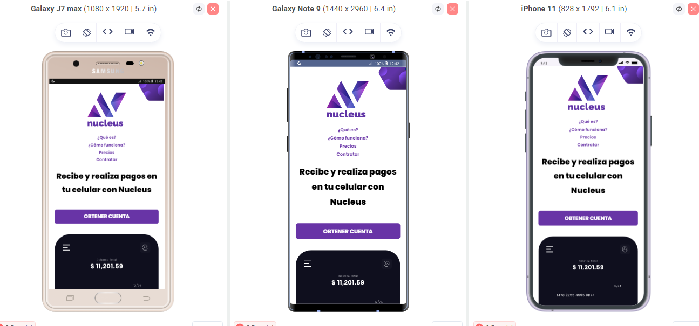
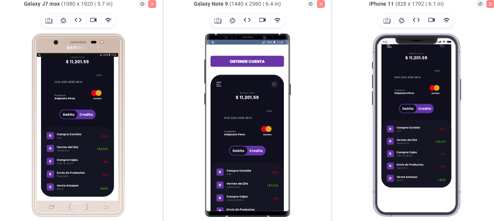

# Nucleus - eWallet App

##Descripcion

Nucleus es una aplicación de billetera digital (eWallet) diseñada para facilitar la gestión y realización de pagos desde tu celular de manera rápida, segura y sencilla. Con Nucleus puedes enviar y recibir dinero, consultar tu saldo y movimientos, y acceder a herramientas de seguridad avanzadas para proteger tus transacciones. Su interfaz moderna y responsiva permite una experiencia intuitiva tanto en dispositivos móviles como en escritorio, haciendo que el manejo de tus finanzas sea más eficiente y accesible.

## Demo

[Nucleus.app](https://nucleus-app-2025.netlify.app)

---

## Screenshot

---

## Detalle del Proyecto

**Nucleus** es una landing page para una aplicación de billetera digital (eWallet). El sitio está construido con HTML5 y CSS3, utilizando la fuente Poppins y un diseño responsive.  
Incluye las siguientes secciones:

- **Header:** Logo, navegación y llamada a la acción.
- **¿Qué es?:** Explicación visual y textual de la app.
- **Seguridad:** Beneficios y características de seguridad.
- **Comisiones:** Tabla de comisiones según el uso.
- **Testimoniales:** Opiniones de usuarios.
- **Footer:** Información de autor, navegación y logo.

El diseño es adaptable a dispositivos móviles y de escritorio, usando Flexbox y Grid para la maquetación.

---

## Instalación y Uso

1. Clona o descarga este repositorio.
2. Abre el archivo `index.html` en tu navegador.
3. Asegúrate de tener la carpeta `img` y la carpeta `css` con los archivos correspondientes.

---

## Autor

- **Javier Eduardo**

## Demo

Puedes ver una demo visual del proyecto abriendo el archivo `index.html` en tu navegador.

---

## Screenshot

---

## Detalle del Proyecto

**Nucleus** es una landing page para una aplicación de billetera digital (eWallet). El sitio está construido con HTML5 y CSS3, utilizando la fuente Poppins y un diseño responsive.  
Incluye las siguientes secciones:

- **Header:** Logo, navegación y llamada a la acción.
- **¿Qué es?:** Explicación visual y textual de la app.
- **Seguridad:** Beneficios y características de seguridad.
- **Comisiones:** Tabla de comisiones según el uso.
- **Testimoniales:** Opiniones de usuarios.
- **Footer:** Información de autor, navegación y logo.

El diseño es adaptable a dispositivos móviles y de escritorio, usando Flexbox y Grid para la maquetación.

---

## Instalación y Uso

1. Clona o descarga este repositorio.
2. Abre el archivo `index.html` en tu navegador.
3. Asegúrate de tener la carpeta `img` y la carpeta `css` con los archivos correspondientes.

---

## Autor

- **Javier Eduardo**